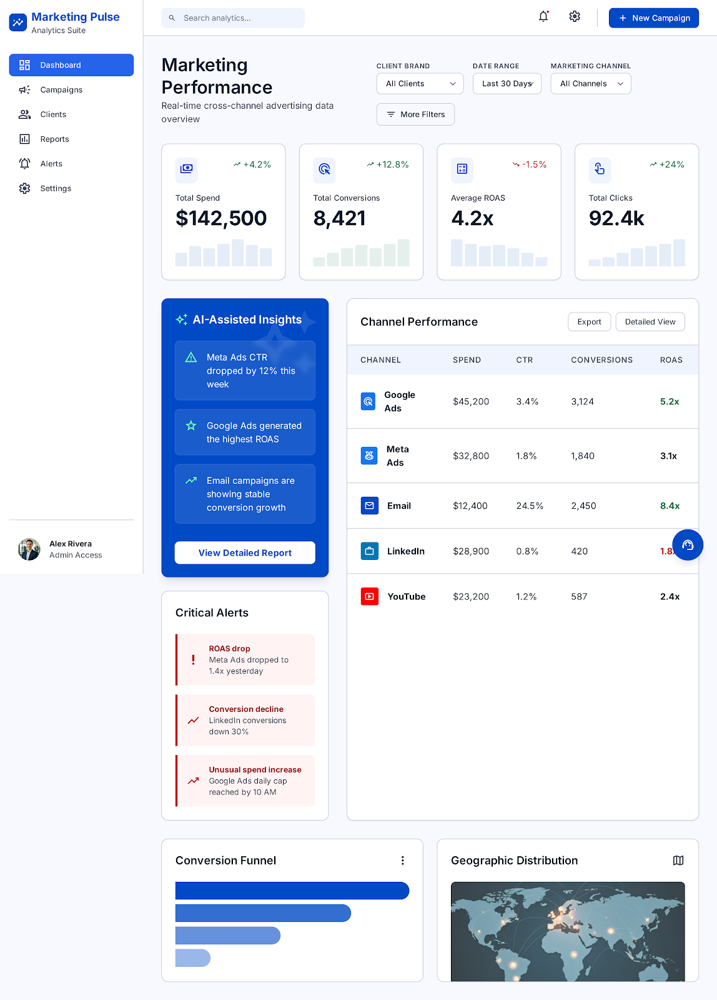

# Task 1 — Product Scoping

## Overview

This task focuses on scoping an internal marketing intelligence tool designed to help marketing teams quickly understand campaign performance across multiple channels.

The proposed solution, **Marketing Pulse**, centralizes marketing data from existing platforms and provides a unified dashboard for faster and more consistent reporting.

---

# Problem Being Solved

Marketing teams currently:

* Pull data manually from multiple platforms
* Spend significant time preparing reports
* Produce inconsistent answers depending on who performs the analysis
* Depend heavily on specific team members for reporting knowledge

The goal of the tool is to reduce manual effort, improve consistency, and create a reliable single source of truth for marketing performance.

---

# Proposed Solution

The solution combines:

* Automated data collection from marketing platforms
* A centralized reporting dashboard
* AI-assisted insights (future scope)

The platform integrates with existing tools without changing current workflows.

---

# Included Deliverables

This folder contains:

* `product_brief.md` — Detailed product scoping document
* `dashboard-wireframe.png` — Initial dashboard prototype/wireframe

---

# Dashboard Prototype

---

# Key Product Decisions

## Why V1 focuses only on the dashboard

The first version prioritizes:

* Reliable data aggregation
* Consistent reporting
* User trust

Advanced AI functionality is intentionally postponed until the underlying data foundation is stable.

---

# Future Improvements

Potential future enhancements include:

* AI-generated recommendations
* Conversational analytics interface
* Client-facing portal
* Attribution analysis
* Campaign-level drilldowns

---

# What I Would Revisit With More Time

* User interviews with analysts and account managers
* Validation of alert thresholds
* API integration feasibility checks
* Build vs buy dashboard tooling decisions
